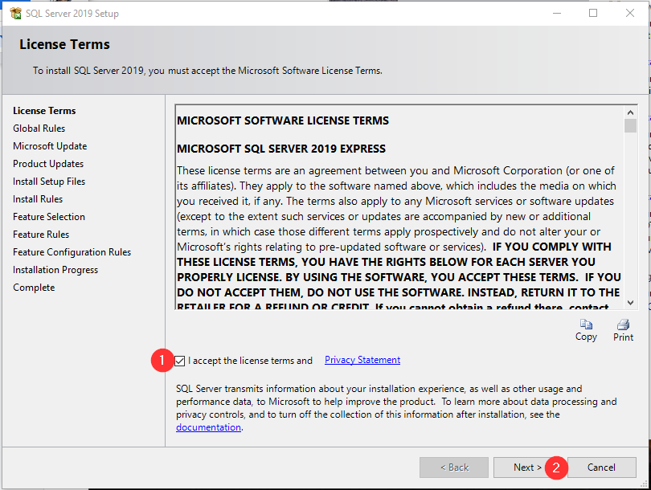
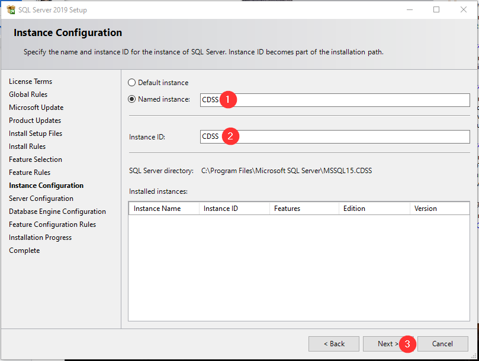
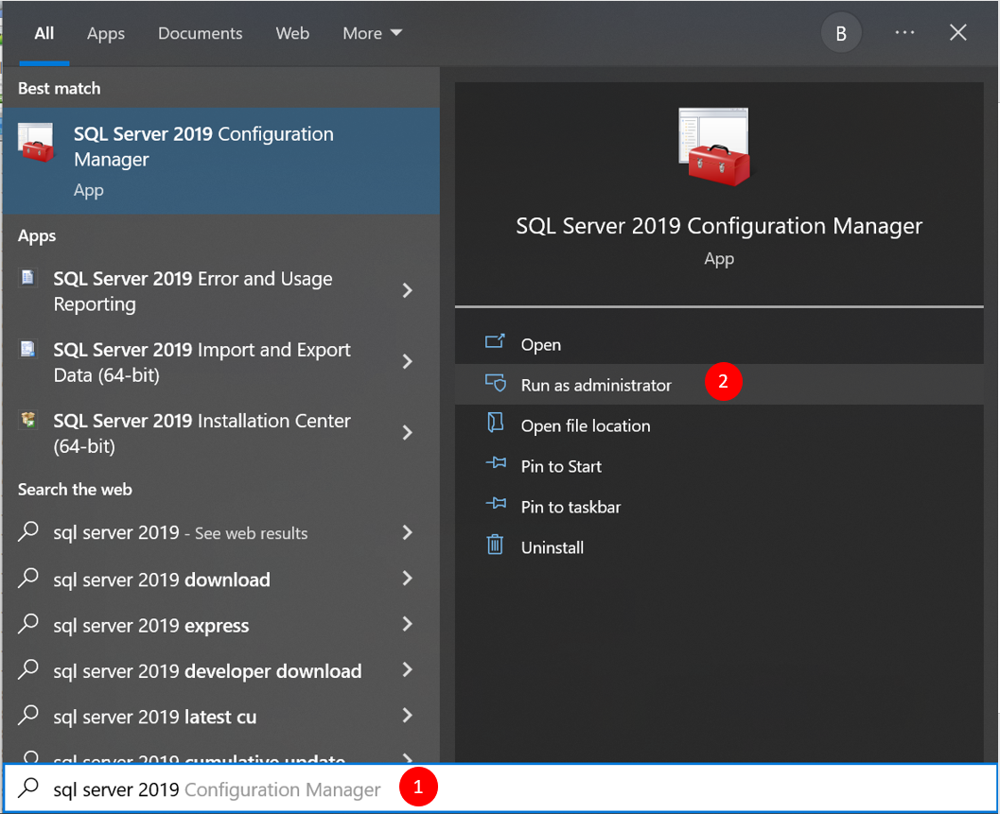
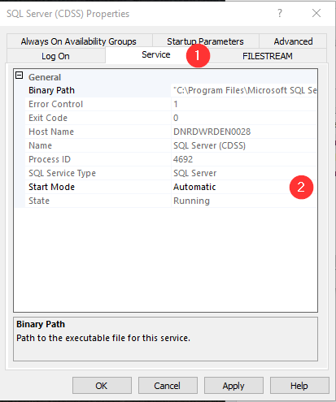
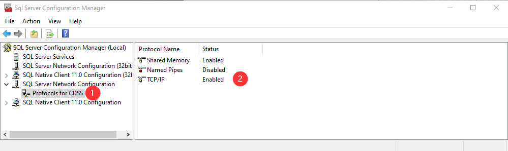
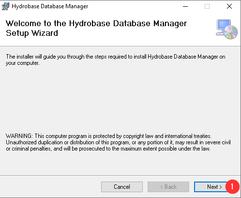
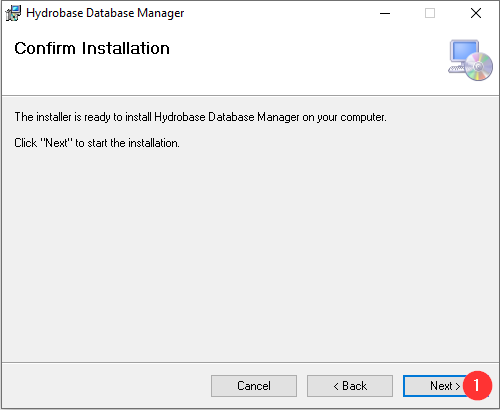

# How to Install the Full HydroBase Database from the Cloud (Internet)#

**Last updated: 2021-01-30**

This page includes the following sections:

* [Introduction](#introduction)
* [Download the HydroBase Installer Package](#download-the-hydrobase-installer-package)
* [Installing a local SQL Server (CDSS) Instance](#installing-a-local-sql-server-cdss-instance)
	* [Verify SQL Server is Configured Properly](#verify-sql-server-is-configured-properly)
		* [Verify that SQL Server (CDSS) Service is Running](#verify-that-sql-server-cdss-service-is-running)
		* [Verify that SQL Server Browser Service is Running](#verify-that-sql-server-browser-service-is-running)
		* [Verify SQL Server Network Configuration](#verify-sql-server-network-configuration)
* [Installing HydroBase Database Manager](#installing-hydrobase-database-manager)
* [Attaching Versions of HydroBase to Local SQL Server (CDSS) Instance](#attaching-versions-of-hydrobase-to-local-sql-server-cdss-instance)
* [Troublehsooting](#troubleshooting)
	* [Uninstalling Previous Versions of SQL Server](#uninstalling-previous-versions-of-sql-server)
	* [Determining What Version of SQL Server (CDSS) is Installed](#determining-what-version-of-sql-server-cdss-is-installed)
	* [Errors when Installing SQL Server or Trying to Attach a HydroBase File](#errors-when-installing-sql-server-or-trying-to-attach-a-hydrobase-file)
	* [Testing HydroBase Connect](#testing-hydrobase-connect)
	* [CDSS Tools Unable to Connect to Local HydroBase Version](#cdss-tools-unable-to-connect-to-local-hydrobase-version)
* [Configure ColoradoHydroBaseRest Datastore in TSTool (version 12.06.00)](#configure-coloradohydrobaserest-datastore-in-tstool-version-120600)
	* [Troubleshooting ColoradoHydroBaseRest Datastore ](#troubleshooting-coloradohydrobaserest-datastore)
	* [Troubleshooting Remote Access to HydroBase Database Server](#troubleshooting-remote-access-to-hydrobase-database-server)

------------

## Introduction ##

This document explains how to install the State of Colorado Division of Water Resources’ HydroBase on a computer.  

The State of Colorado's HydroBase database is maintained by the Colorado Division of Water Resources (DWR) and contains 
water rights, structures, diversions, irrigated lands, streamflow, and other data.

Images of HydroBase are released periodically on the Colorado Department of Natural Resources' [FTP Site](https://dnrftp.state.co.us/#/DWR/Modeling/HydroBase/). 
These images are often used for modeling purposes and can be queried with CDSS software such as 
[TSTool](https://cdss.colorado.gov/software/tstool) and [StateDMI](https://cdss.colorado.gov/software/statedmi). 

## Download the HydroBase Installer Package ##

The CDSS Local HydroBase Installer package is available by downloading the following file:

[https://dnrftp.state.co.us/DWR/Modeling/HydroBase/CDSSLocalHydroBase_Installer.zip](https://dnrftp.state.co.us/DWR/Modeling/HydroBase/CDSSLocalHydroBase_Installer.zip)

Download the file and then unzip the file to expand its contents to a temporary location. It is important to actually unzip the files so that the installer(s) will work properly.

You will also want to download a current HydroBase version. The following web site contains an archive of all HydroBase snapshots available to the public.

[https://dnrftp.state.co.us/DWR/Modeling/HydroBase/](https://dnrftp.state.co.us/DWR/Modeling/HydroBase/)


## Installing a local SQL Server (CDSS) Instance ##

In the directory where the CDSS Local HydroBase Installer package is extracted, there is a directory labelled 
“CDSS_Database”.  Navigate to this directory and double click on **SQLEXPR_x64_ENU.exe**, this will start the SQL 
Server Express setup process.


1) Specify the temporary location for the SQL Server Express installation files.


1) Select “New SQL Server stand-alone installation…”



1) Click checkbox to accept the Microsoft license terms

2) Click Next


Recommend NOT checking the “Use Microsoft Update…” checkbox

1) Click Next


This will verify that the computer meets requirements for SQL Server Express installation. You may need to address Failed Rules before being able to proceed.

1) Click Next


1) If desired, you can override the default Instance root directory

2) Click Next


1) **CRITICAL** Set Named Instance to CDSS

2) **CRITICAL** Set Instance ID to CDSS

3) Click Next


1) Click Next


1) Change Authentication Mode to “Mixed Mode”

2) **CRITICAL** Set password to CdssHydr0B@se and confirm password

3) Click Next


1) Click Close

SQL Server Express should now be successfully installed.

### Verify SQL Server is Configured Properly ###


1) Click on the Windows Start button, and type `SQL Server 2019 Configuration Manager`

2) Click on the program icon.

#### Verify that SQL Server (CDSS) service is running ####


1) Click on SQL Server Services

2) Verify there is a line called SQL Server (CDSS) with a State of Running.  If it is not running, 
right click on the line and select “Properties”.



1) Click on the Service tab

2) Click on the Start Mode drop-down and change to “Automatic”

Click the OK button

Right hand click on the SQL Server Browser line and select “Start”.


#### Verify that SQL Server Browser service is running ####


1) Click on SQL Server Services

2) Right hand click on the SQL Server Browser line and select “Properties”.


1) Click on the Service tab

2) Click on the Start Mode drop-down and change to “Automatic”

Click the OK button

Right hand click on the SQL Server Browser line and select “Start”.

#### Verify SQL Server Network Configuration ####



1) Expand the SQL Server Network Configuration option

2) TCP/IP should be enabled. If not, right click on TCP/IP and select Enabled. You should be prompted to stop and restart the service.


To restart the service:


1) Click on SQL Server Services

2) Right hand click on SQL Server (CDSS)

3) Click on Restart

## Installing HydroBase Database Manager ##

HydroBase Database Manager is used to connect snapshots of HydroBase to the SQL Server (CDSS) 
instance on the computer.   If you have not already done so, go to the DNR FTP Site and download 
a version of HydroBase.


**Recommendation**

We recommend downloading and extracting HydroBase versions in a directory similar to “C:\HydroBase\Data\” 
to make managing versions of HydroBase easier.

In the directory where the CDSS Local HydroBase Installer package is extracted, there is a directory labelled 
“HydroBaseDbManager”.  Navigate to this directory and double click on **setup.exe**, this will start the SQL Server 
Express setup process.



1) Click Next


1) If desired, you can override the default Instance root directory
2) Click Next



1) Click Next


1) Click Close

Hydrobase Database Manager should now be successfully installed.

The setup program does not create a Start Menu shortcut.  You may want to create a shortcut to the application. 
The manager application is located in:

C:\Program Files (x86)\Division of Water Resources\Hydrobase Database Manager

The shortcut target should be **HydroBaseMaintenanceUtilty.exe**.  We also include an ICO file if you want to change the 
shortcut icon.

## Attaching versions of HydroBase to local SQL Server (CDSS) Instance ##

To attach versions of HydroBase, you will need to run the HydroBase Database Manager. If you did not create a shortcut 
when you initially installed the program then the manager is located in:

C:\Program Files (x86)\Division of Water Resources\Hydrobase Database Manager

Run the **HydroBaseMaintenanceUtilty.exe** program.


1) Click OK


1) Click the Attach DB


1) Navigate to the directory where you extracted the Hydrobase version to and select the file you want to attach.

2) Click Open


Microsoft will suggest you move the file to the SQL Data Directory but we recommend keeping it in the DATA directory 
you created to store and organize HydroBase versions.


1) Click Exit

## Troubleshooting ##

### Uninstalling Previous Versions of SQL Server ###

Older versions of SQL Server can run into security issues after Microsoft Security patches are released. 
For this reason, we recommend using the most recent version of SQL Server Express included in the installation package.

To make uninstalling previous versions of SQL Server (CDSS) easier, we have included uninstall batch files 
in the “Troubleshooting” folder.

Follow the steps in [Determining What Version of SQL Server (CDSS) is Installed](#determining-what-version-of-sql-server-cdss-is-installed) 
and then run the appropriate uninstall batch file. Double click the .bat file to run the batch file. 

### Determining what version of SQL Server (CDSS) is installed ###

* Open a command prompt window (Run as Administrator) .
* Execute the following command:
* SQLCMD -S localhost\CDSS
* At the 1 > prompt, type `select @@version` and press `<Enter>`.
* At the 2 > prompt, type `go` and press `<Enter>`.
* The SQL version running on the server displays in the dialog box.

### Errors when installing SQL Server or trying to attach a HydroBase file ###

When you try to install SQL Server or attach a database file you get one of the following messages:

`SqlServer.Configuration.Sco.DirectoryAttributesMissmatch: Folder C:\Program Files\Microsoft SQL Server has an unsupported attribute (Compressed) set. Please resolve this issue by removing the unsupported attribute from the folder using folder properties dialog.`

`SqlServer.Configuration.SetupExtension.CompressedDirException: The specified directory, “C:\Program Files\Microsoft SQL Server\”, for the INSTALLSHAREDDIR parameter is not valid because this directory is compressed or is in a compressed directory. Specify a directory that is not compressed.`

`SqlServer.Configuration.SetupExtension.CompressedDirException: The specified directory, “C:\Program Files (x86)\Microsoft SQL Server\”, for the INSTALLSHAREDWOWDIR parameter is not valid because this directory is compressed or is in a compressed directory. Specify a directory that is not compressed.`


* On the desired folder (in this case “C:\Program Files”) right click and go to properties.

* Click on the “Advanced” button.

* Uncheck the box “Compress the drive to save space”

* Click Apply and then OK.

* Let the process finish.

### Testing HydroBase Connect ###
In the directory where the CDSS Local HydroBase Installer package is extracted, there is a directory 
labelled “Troubleshooting”.  Navigate to this directory and double click on **TestDatabase_Connection.udl**, 
this will start the Data Link Properties dialog.


1) Click the “Select the database on server…” drop-down.  You should see a list of all databases attached to 
your SQL Server (CDSS) Instance.
	
If you get the following message:


* SQL Server was not configured properly. See the [Verify SQL Server is Configured Properly](#verify-sql-server-is-configured-properly) section. 
* If SQL Server is configured properly then the CDSS Instance or Mixed Mode password may have been entered incorrectly during installation.
* If SQL Server is configured properly and you entered the Mix Mode password properly, please use [Ask DWR](https://dwr.state.co.us/Portal/dwr/AskDWR?topicNum=5&officeNum=8&subject=Local%20HydroBase%20Installation%20Troubleshooting) to request help.  Please include any error messages you are getting.

2) Click the Test Connection Button

If you get Test Connection succeed then the database and permissions are successfully configured.

If you get Test Connection failed:
* See the [Verify SQL Server is Configured Properly](#verify-sql-server-is-configured-properly) section
* If SQL Server is configured properly, please use [Ask DWR](https://dwr.state.co.us/Portal/dwr/AskDWR?topicNum=5&officeNum=8&subject=Local%20HydroBase%20Installation%20Troubleshooting) to request help.  Please include any error messages you are getting.

3) Click OK.

### CDSS Tools Unable to Connect to Local HydroBase Version ###

Unfortunately, if either the SQL Server (CDSS) Instance or HydroBase Database Manager fails it can be 
difficult to troubleshoot. The State of Colorado DWR staff has attempted to put together and test an 
installation guide that will work with Windows 10 but may not have resources to help diagnose all issues 
that might be uniquely configured on local machines.

Software such as virus checkers and firewalls may interfere with communication between the TSTool software 
and HydroBase. 

OpenCDSS also includes additional [Troubleshooting](http://opencdss.state.co.us/tstool/13.03.00dev/doc-user/troubleshooting/troubleshooting/#issue-2b-error-connecting-to-state-of-colorados-hydrobase-database-on-local-computer) 
documentation that may be useful to identify and resolve issues.


## Configure ColoradoHydroBaseRest Datastore in TSTool (version 12.06.00) ##

A datastore is a newer TSTool feature that allows direct database queries, for example using the TSTool 
ReadTableFromDataStore() command.  If configured, the HydroBase datastore can be selected at the top of the main 
window as an alternative to the ***Input Type*** database connection (both essentially point to the same database 
but the datastore provides newer software capabilities).

The following configuration file (provided with TSTool installer C:\CDSS\TSTool-Version\system\ColoradoHydroBaseRest.cfg) 
indicates how to enable the HydroBase REST datastore in TSTool. In order for the Datastore to work, an API key must be 
obtained from the [DWR website](https://dnrweb.state.co.us/DNR/Portal/Dwr/WebServiceManager). An account must be created 
with the DWR website, and then the API key (or Web Service Token) will be provided. 

```text
# Configuration information for "ColoradoHydroBaseRest" web service data store.
# Properties are:
#
# ApiKey - web service API Key used to authorize greater usage
# Enabled - indicates if the datstore is enabled (active)
# ServiceApiDocumentationUri - URI for online API documentation
# Type - must be ColoradoHydroBaseRestDataStore to find proper software
#
# The user will see the following when interacting with the data store:
#
# Name - data store identifier used in applications, for example as the
#     input type information for time series identifiers (usually a short string)
# Description - data store description for reports and user interfaces (short phrase)
# ServiceRootURI - web service root URI, including the server name and root path

Enabled = True
Type = "ColoradoHydroBaseRestDataStore"
Name = "ColoradoHydroBaseRest"
Description = "Colorado HydroBase REST web Service"
ServiceRootURI = "https://dnrweb.state.co.us/DWR/DwrApiService/api/v2"
ApiKey = "YOUR_API_KEY"
ServiceApiDocumentationUri = "https://dnrweb.state.co.us/DWR/DwrApiService/Help"
```

### Troubleshooting ColoradoHydroBaseRest Datastore ###

If the HydroBase datastore is configured as described above but is not listed under ***View…Datastores***, then try the 
following:

* Confirm that the configuration information is accurate, in particular the database version number.
* In the Start menu search field, enter “Local Services”
* Select “View local services”
* Scroll down to “SQL Server Browser” and start the service.  If the service Startup Type is not listed as “Automatic”, 
right-click on the service to edit its properties and set to automatic.

### Troubleshooting Remote Access to HydroBase Database Server ###

It is possible to install HydroBase on one computer and access it from another machine, for example in an office setting. 
In this case the HydroBase datastore configuration file may look similar to the following:

```text
# Change the following to True to enable the datastore
Enabled = True
Type = "HydroBaseDataStore"
Name = "HydroBase"
Description = "HydroBase Datastore"
DatabaseEngine = "SqlServer"
# HydroBase SQL Server Express installation on local machine...
DatabaseServer = "ServerName"
DatabaseName = "HydroBase_CO_20140719"
```

In this case the `DatabaseServer` property is simply the computer name (no trailing `\CDSS`).  If such a configuration 
results in an error connecting to HydroBase, it may be due to the server computer running a firewall that prevents database 
traffic.  For example, if using the Windows Firewall on Windows 7, start the configuration tool as follows:


Next, select ***Inbound Rules*** item on the left:


Then select the ***Action...New Rule*** menu (make sure that no Inbound Rules are select for this menu item to be available). 
Then select the following:

* ***Port***
* ***TCP*** and Specific local ports 21784, which correspond to SQL Server port used by HydroBase to communicate with software such as TSTool.
* ***Allow the connection***
* Check ***Domain*** and ***Private*** (uncheck ***Public***) to indicate when the rule is active
* Provide a ***Name***, for example:  `SQL Server TCP`

Perform a similar configuration for the ***Outbound Rules*** list.  Consequently there will be 2 configurations.

The database should then be accessible to other computers within the local network.
