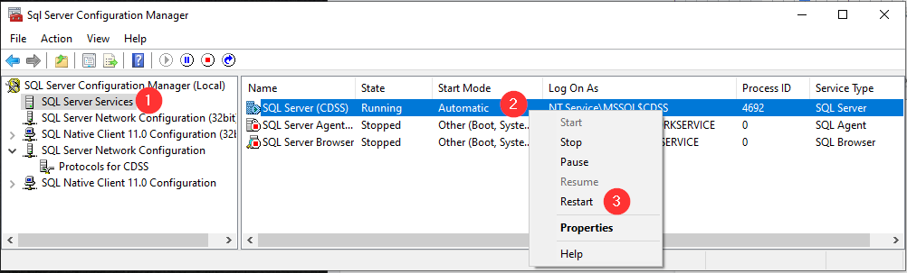
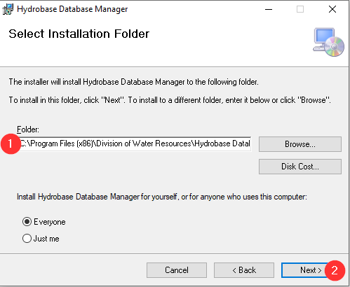

# Attach HydroBase Locally #

This document explains how to install the State of Colorado’s HydroBase on a computer for the first time, 
using files downloaded from the internet.  HydroBase is the State of Colorado Division of Water Resource’s 
database used for water resources data and is distributed by the State as SQL Server Express on a DVD.  
Installing the database involves downloading and running the installer.  After installing the first time, 
new HydroBase versions can be installed using steps documented in Section "Attach HydroBase Database" of this document.

This page includes the following sections:

* [Download the HydroBase Installer](#download-the-hydrobase-installer)
* [Run HydroBase Installer for the First Time](#run-hydrobase-installer-for-the-first-time)
* [Accept HydroBase License](#accept-hydrobase-license)
* [Select HydroBase Components to Install](#select-hydrobase-components-to-install)
* [Install SQL Server Express](#install-sql-server-express)
* [Run HydroBase Installer for the Second Time](#run-hydrobase-installer-for-the-second-time)
* [Attach HydroBase Database to SQL Server using the HydroBase Database Manager](#attach-hydrobase-database-to-sql-server-using-the-hydrobase-database-manager)
* [Attach HydroBase Database](#attach-hydrobase-database)
* [Test Database Connection](#test-database-connection)
* [Configure ColoradoHydroBaseRest Datastore in TSTool (version 12.06.00)](#configure-coloradohydrobaserest-datastore-in-tstool-(version-12.06.00))
* [Troubleshooting](#troubleshooting)
* [Troubleshooting Remote Access to HydroBase Database Server](#troubleshooting-remote-access-to-hydrobase-database-server)

------------

## Download the HydroBase Installer ##

The HydroBase installer is provided as a .zip file (“HydroBaseDVD_20140719.zip”) and is available on the [CDSS FTP site](https://dnrftp.state.co.us/#/DWR/Modeling/HydroBase/).

Download the file to a temporary location, for example using a folder name that matches the database version:

	C:\Users\YourLogin\Downloads\HydroBaseDVD_20140719

Then unzip the file to expand the contents, for example using the Winzip or free 7Zip software to create a folder like:

	C:\Users\YourLogin\Downloads\HydroBaseDVD_20140719\dvd

The above folder will contain all of the files needed to install HydroBase.  It is important to actually unzip the files so that the installer will work properly.

## Run HydroBase Installer for the First Time ##

To install the full HydroBase, run the Setup.exe file in the installer files.  This will be in the folder from the download (section 2 above) or the DVD drive (section 3 above).  If installing from a DVD the Setup.exe may run automatically on some computers when the DVD is inserted into the computer.  The HydroBase installer should be run with administrative privileges to ensure that SQL Server and CDSS software is properly installed and configured, for example as shown in the following figure (right-click to display the pop-up menu):


## Accept HydroBase License ##

The following screen will be displayed showing the HydroBase license.  In actuality, the agreement is more of a disclaimer than a license.  Those who install HydroBase should understand that although the State has invested in the development of the software installer, they do not warranty the software or database.


Press ***I Agree*** to continue the installation.

## Select HydroBase Components to Install ##

The installer will ask for components to install, as shown in the following figure.  The only change to consider is selecting ***CDSS GIS files***, which will install shapefiles and other data in the C:\CDSS\GIS folder.  These files are used by CDSS software such as StateView and provide data directly that would otherwise need to be downloaded from the State’s website.


Press ***Install*** to start the installation process.

## Install SQL Server Express ##

HydroBase requires installing SQL Server Express, which is a free version of Microsoft’s SQL Server database.  The installation program will detect if a previous CDSS “instance” of SQL Server is already installed and asks for input as needed.  Installing a CDSS instance of SQL Server helps isolate the HydroBase SQL Server from other SQL Server versions that may be installed on the computer.  Installing the HydroBase SQL Server is a multi-step process that will require re-running the installer two times, first to install software, and second to configure the database user accounts.

The following dialog is shown at the start of the SQL Server installation process:


Press ***OK*** to continue the installation.  An informative dialog is then displayed:


Press ***OK*** to continue the installation.  The following progress dialog will be shown:


The SQL Server installation is a fairly long process and will likely take several minutes.  The following dialog will be shown after the initial installation process is complete:


Make sure to save work in other programs and then press ***Yes*** to reboot the computer.

## Run HydroBase Installer for the Second Time ##

After the computer restarts, login, and re-run the HydroBase installer program, as shown in the following figure (right click to display the popup menu):


Similar to before you will be asked to accept the license, as shown below.


Press ***I Agree*** to continue the installation.   Similar to before, you will be asked to confirm the components.  Make sure that the ***CDSS GIS Files*** checkbox is as desired.


Press ***Install*** to start the installation process.  Because the previous installation steps resulted in a CDSS instance of SQL Server being installed, the following dialog will be shown:


A couple of command shell windows will be displayed indicating that SQL Server is stopping and starting.  The progress dialog will then display similar to the following:


Press ***Close*** to start the installation.  A final information dialog will be shown as in the following figure:


At this point the CDSS instance of HydroBase is running on the computer and the TSTool and StateView software have been silently installed under the ***Start…CDSS*** menu.  You can verify that the CDSS instance of SQL Server is running by searching for Local Services:


Click on ***View local services*** in the above to display the services list, as shown in the following figure.  Scroll down to see ***SQL Server (CDSS)*** service, which should have a status of Started.


At this point, although the CDSS instance of SQL Server is running, the HydroBase database is not yet attached to the database software.  To complete this step, close the above services window and press ***OK*** on the HydroBase installation dialog to start the HydroBase Database Manager, which is discussed in the next section.

## Attach HydroBase Database to SQL Server using the HydroBase Database Manager ##

Note that the remaining steps are the same as if installing a HydroBase update distributed as a zip file.

If not automatically done as part of the previous step, start the HydroBase Database Manger:

	Start … CDSS … HydroBase Database Manager

If the software is not available in the Start menu, the menu may have not have been set up during installation and the software needs to be run manually:

	C:\Program Files (x86)\Division of Water Resources\HydroBase Database Manager\HydroBaseMaintenanceUtility.exe

The HydroBase Database Manager will display the following:


A blank list under ***Currently Installed Databases*** indicates that the CDSS instance of SQL Server does not have any HydroBase databases attached to it.  To attach a database, either insert the HydroBase DVD (if being used for the installation) or select a HydroBase file from a folder on the computer in the next step.  Press ***OK*** in the rightmost dialog shown in the above figure to continue.

## Attach HydroBase Database ##

Press the ***Attach DB*** button.  This will display a file selector dialog.  If installing from the DVD, navigate to the DVD and select the zipped HydroBase file, for example:

	D:\CDSS\Data\HydroBase_CO_20140719.zip

If installing from a folder on the computer from an internet download of the database, select the following, for example:

	C:\Users\YourLogin\Downloads\HydroBaseDVD_20140719\dvd\CDSS\Data\ HydroBase_CO_20140719.zip

Select the file and press ***Open*** in the file selector.  The HydroBase Database Manager will unzip the file to the SQL Server database folder and will attach the database to SQL Server so that it can be used.

Note:  If for some reason you copied the zip file to a temporary location and want it removed after installing, check the “Delete File On Detachment?” box in the HydroBase Database Manager.  The default (do not delete file) is the typical selection.

The following dialog will be shown, indicating that the HydroBase zip file is being extracted (see message in bottom of dialog):


If successful, the newly attached database should be listed as shown below (in this case ***Currently Installed Databases*** actually means databases that are installed and attached to the CDSS instance of SQL Server):



Press ***Exit*** to exit the HydroBase Database Manager tool.

## Test Database Connection ##

To test the database connection, start TSTool using ***Start…CDSS…TSTool-Version*** (where Version will be the current version of TSTool released with the HydroBase DVD) and select the latest HydroBase database, as shown in the following figure:


The correct Database Hostname may be ***local*** or ***localhost\CDSS***.

Then specify query parameters as shown in the following figure and press ***Get Time Series List***.  If HydroBase is accessible, time series should be listed as shown in the upper right area in the following figure.



## Configure ColoradoHydroBaseRest Datastore in TSTool (version 12.06.00) ##

A datastore is a newer TSTool feature that allows direct database queries, for example using the TSTool ReadTableFromDataStore() command.  If configured, the HydroBase datastore can be selected at the top of the main window as an alternative to the ***Input Type*** database connection (both essentially point to the same database but the datastore provides newer software capabilities).

The following configuration file (provided with TSTool installer C:\CDSS\TSTool-Version\system\ColoradoHydroBaseRest.cfg) indicates how to enable the HydroBase REST datastore in TSTool. In order for the Datastore to work, an API key must be obtained from the [DWR website](https://dnrweb.state.co.us/DNR/Portal/Dwr/WebServiceManager). An account must be created with the DWR website, and then the API key (or Web Service Token) will be provided. 

```text
# Configuration information for "ColoradoHydroBaseRest" web service data store.
# Properties are:
#
# ApiKey - web service API Key used to authorize greater usage
# Enabled - indicates if the datstore is enabled (active)
# ServiceApiDocumentationUri - URI for online API documentation
# Type - must be ColoradoHydroBaseRestDataStore to find proper software
#
# The user will see the following when interacting with the data store:
#
# Name - data store identifier used in applications, for example as the
#     input type information for time series identifiers (usually a short string)
# Description - data store description for reports and user interfaces (short phrase)
# ServiceRootURI - web service root URI, including the server name and root path

Enabled = True
Type = "ColoradoHydroBaseRestDataStore"
Name = "ColoradoHydroBaseRest"
Description = "Colorado HydroBase REST web Service"
ServiceRootURI = "https://dnrweb.state.co.us/DWR/DwrApiService/api/v2"
ApiKey = "YOUR_API_KEY"
ServiceApiDocumentationUri = "https://dnrweb.state.co.us/DWR/DwrApiService/Help"
```

## Troubleshooting ##

Unfortunately, if the HydroBase Database Manager fails, it can be difficult to troubleshoot.  

Software such as virus checkers and firewalls may interfere with communication between the TSTool software and HydroBase.  For example a warning may be displayed when TSTool is started because TSTool tries to locate database servers.  Granting access to TSTool often resolves this issue.

If the HydroBase datastore is configured as described above but is not listed under ***View…Datastores***, then try the following:

* Confirm that the configuration information is accurate, in particular the database version number.
* In the Start menu search field, enter “Local Services”
* Select “View local services”
* Scroll down to “SQL Server Browser” and start the service.  If the service Startup Type is not listed as “Automatic”, right-click on the service to edit its properties and set to automatic.

## Troubleshooting Remote Access to HydroBase Database Server ##

It is possible to install HydroBase on one computer and access it from another machine, for example in an office setting.  In this case the HydroBase datastore configuration file may look similar to the following:

```text
# Change the following to True to enable the datastore
Enabled = True
Type = "HydroBaseDataStore"
Name = "HydroBase"
Description = "HydroBase Datastore"
DatabaseEngine = "SqlServer"
# HydroBase SQL Server Express installation on local machine...
DatabaseServer = "ServerName"
DatabaseName = "HydroBase_CO_20140719"
```

In this case the `DatabaseServer` property is simply the computer name (no trailing `\CDSS`).  If such a configuration results in an error connecting to HydroBase, it may be due to the server computer running a firewall that prevents database traffic.  For example, if using the Windows Firewall on Windows 7, start the configuration tool as follows:


Next, select ***Inbound Rules*** item on the left:


Then select the ***Action...New Rule*** menu (make sure that no Inbound Rules are select for this menu item to be available).  Then select the following:

* ***Port***
* ***TCP*** and Specific local ports 21784, which correspond to SQL Server port used by HydroBase to communicate with software such as TSTool.
* ***Allow the connection***
* Check ***Domain*** and ***Private*** (uncheck ***Public***) to indicate when the rule is active
* Provide a ***Name***, for example:  `SQL Server TCP`

Perform a similar configuration for the ***Outbound Rules*** list.  Consequently there will be 2 configurations.

The database should then be accessible to other computers within the local network.
